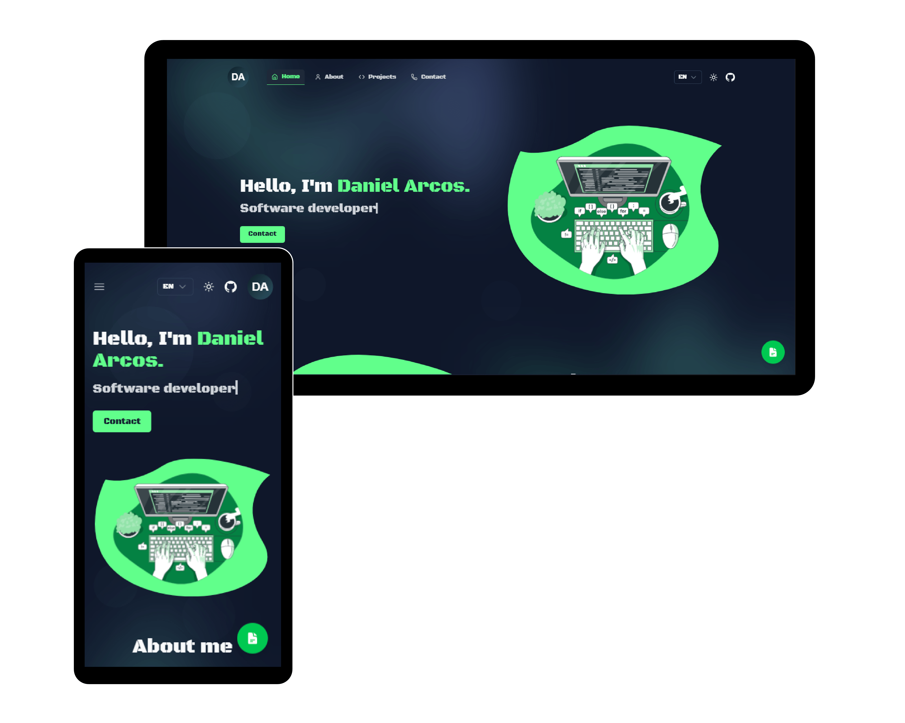

# 💼 Portafolio Personal – Daniel Arcos

[](https://nuxt.com)
[](https://tailwindcss.com)
[](https://vercel.com)
[](https://github.com/daniel242002/my-portfolio)

---

## 🚀 Demo en vivo

🔗 **[Ver portafolio desplegado en Vercel](https://tu-portafolio.vercel.app)**

<div align="center">
    
</div>

---

## 📌 Descripción

Este es mi portafolio personal desarrollado con **Nuxt 3** y **Tailwind CSS**, donde muestro mis habilidades, proyectos y formas de contacto.  
Cuenta con un diseño responsive, animaciones suaves y despliegue automatizado mediante **Vercel**.

---

## 🛠️ Tecnologías utilizadas

- [Nuxt 3](https://nuxt.com) – Framework Vue de última generación
- [Tailwind CSS](https://tailwindcss.com) – Estilos rápidos y responsivos
- [Vercel](https://vercel.com) – Hosting y CI/CD
- [VueUse](https://vueuse.org/) – Composables útiles para Vue
- [Heroicons / Grommet Icons](https://heroicons.com) – Iconografía

---

## ⚙️ Instalación y ejecución local

```bash
# Clonar repositorio
git clone https://github.com/daniel242002/my-portfolio.git

# Entrar al directorio
cd my-portfolio

# Instalar dependencias
npm install

# Ejecutar en modo desarrollo
npm run dev

# Compilar para producción
npm run build
```
